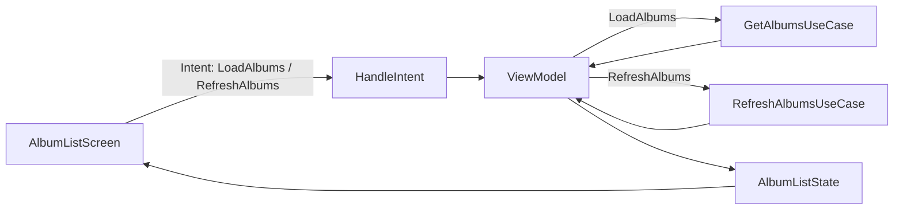
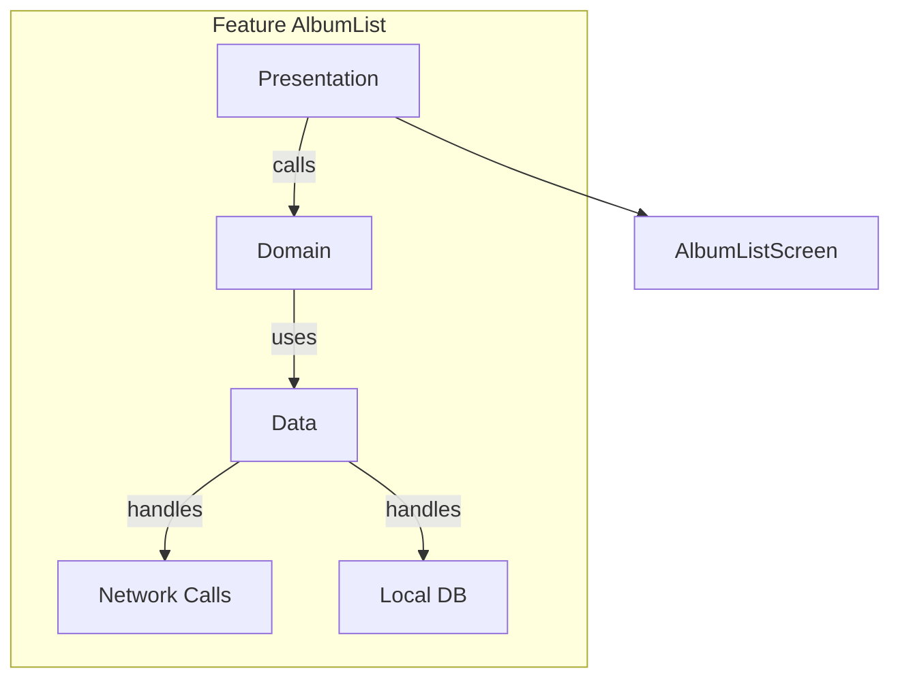

# Album List challenge

## The task

Provide a list of albums retrieved from the API provided by the Recruitments team.
The app should show a list of Albums that are loaded while scrolling and each item must show a Thumbnail image and the title of the album.
Beside that each item also have a link to a webview that shows the image in a bigger size, it use the URL provided in the API, if the URL redirect to another webpage it will show that page.

---

## Architecture

Since app was developed using JetPack Compose, I decided to apply the MVI architecture since it is one of the most recent pattern for it.
The app is modularized following the Clean Architecture principle with SOLID patterns applied as well. 
Regard the modularization the app is divided in 2 Main Modules:

### Modules Overview

| Module             | Type      | Responsibility                                                        | Depends On      |
|--------------------|-----------|-----------------------------------------------------------------------|-----------------|
| `app`              | Android   | Main entry point, DI setup for network                                | All features    |
| `feature-albumList`| Feature   | Album List UI, Divided with Data, Domain, Navigation and Presentation | App Module      |

#### Feature Album List submodule

| SubModule          | Layer                   | Responsibility                                                           | Depends On               |
|--------------------|-------------------------|--------------------------------------------------------------------------|--------------------------|
| `data`             | Data                    | Handles repositories, DTOs, API Calls, Room DB, data sources             | App Module               |
| `domain`           | Domain                  | Contains use cases, business rules, pure Kotlin (no Android Dependecies) | Data Module              |
| `navigation`       | Navigation              | Defines navigation graph, routes, and entry points for this feature      | Presentation (for entry) |
| `presentation`     | Presentation (UI + MVI) | Composable/Fragment, ViewModel, intents, states, UI Logic.               | Domain Module, Navigation|

The MVI Architecture can be noticed in the Presentation Module by the following:
## MVI Flow: AlbumList

---

### 🔎 How it looks:
- **User (AlbumListScreen)** sends **intents**.  
- **HandleIntent** routes them.  
- **ViewModel** calls the right **use case**.  
- **Use case** returns data back to the **ViewModel**.  
- **ViewModel** updates **AlbumListState**.  
- **State** is rendered in **AlbumListScreen** again.  

---

## Patterns

The app use some Patterns:

## 1. Architectural Patterns

- **Clean Architecture**  
  - Separation of layers: `data → domain → presentation`  
  - Dependency inversion (inner layers don’t depend on outer ones)  
- **MVI (Model-View-Intent)**  
  - `Intent → State → UI`  
  - Single source of truth for UI state  

---

## 2. Design Patterns

**Coding-level patterns used inside modules:**

- **Repository Pattern** – abstracts data sources  
- **Use Case (Interactor) Pattern** – encapsulates business logic  
- **Adapter / Mapper Pattern** – maps DTO ↔ domain models  
- **Navigator Pattern** – isolates navigation logic per feature  
- **Dependency Injection** – Hilt/Dagger  

---

## 3. UI Patterns

**How UI is structured (Compose/Views):**

- **Unidirectional Data Flow (UDF)**  
- **State hoisting** – UI reads immutable state, sends events upward  
- **Composable hierarchy** – stateless Composables, nested structure  

---

## 4. Testing Patterns

- Unit tests on use cases (pure Kotlin domain)  
- Fake/Mock repositories in tests  
- Given/When/Then structure  

---

## 5. Module Communication Patterns

- Features only talk through **public APIs** (navigation contracts)   
- No **circular dependencies** allowed  

---

## 6. Code Organization Patterns

- Naming conventions: `feature-xxx-data`, `feature-xxx-domain`, etc.  
- Package structure inside each module: `ui/`, `di/`, `mapper/`  
- Standard folder layout for consistency  

---

### Architecture Flow

---

## Libraries

The following libraries have been used to develop and test this app:

| Library | Version | Purpose / Reason |
|---------|---------|-----------------|
| **AndroidX Core KTX** (`androidx-core-ktx`) | 1.17.0 | Kotlin extensions for Android APIs, makes code more concise and idiomatic. |
| **JUnit** (`junit`) | 4.13.2 | Standard unit testing framework for JVM. |
| **AndroidX Test JUnit** (`androidx-junit`) | 1.3.0 | Android-specific extensions for running unit tests on the device/emulator. |
| **Espresso Core** (`androidx-espresso-core`) | 3.7.0 | UI testing framework for Android, allows automated UI interaction and assertions. |
| **Lifecycle Runtime KTX** (`androidx-lifecycle-runtime-ktx`) | 2.9.4 | Lifecycle-aware components with Kotlin coroutines support. |
| **Activity Compose** (`androidx-activity-compose`) | 1.11.0 | Integration of Jetpack Compose with Android activities. |
| **Compose BOM** (`androidx-compose-bom`) | 2025.09.01 | Manages consistent versions of Compose libraries. |
| **Compose UI / Tooling / Material3** | 2025.09.01 | Core libraries for building UI with Jetpack Compose, including preview and Material Design components. |
| **Material Icons Extended** (`androidx-icons-extended`) | 2025.09.01 | Extended set of Material icons for Compose. |
| **Hilt (DI)** (`dagger-hilt-android` / `hilt-compiler`) | 2.57.2 | Dependency injection framework, reduces boilerplate for DI setup. |
| **Hilt Navigation Compose** | 1.3.0 | Integrates Hilt DI with Compose Navigation. |
| **Retrofit** (`retrofit`) | 3.0.0 | HTTP client for REST APIs, easy JSON serialization/deserialization. |
| **Retrofit Moshi Converter** | 3.0.0 | Converts JSON responses to Kotlin/Java objects using Moshi. |
| **OkHttp / Logging Interceptor** | 5.1.0 | Network client and logging for debugging API calls. |
| **Moshi / Moshi-Kotlin** | 1.15.2 | JSON parsing library for Kotlin, integrates with Retrofit. |
| **Kotlinx Coroutines** (`core` / `android`) | 1.10.2 | Asynchronous programming using coroutines for networking, DB, and background tasks. |
| **Coil Compose** | 2.7.0 | Image loading library for Jetpack Compose. |
| **Paging Runtime / Compose / Common** | 3.3.6 | Handles pagination of large datasets efficiently in UI and database. |
| **Room (Runtime / KTX / Compiler / Paging)** | 2.8.1 | Local database solution with compile-time safety, Kotlin extensions, and integration with paging. |
| **MockK** | 1.14.5 | Mocking library for unit tests in Kotlin. |
| **Coroutines Test** | 1.10.2 | Utilities for testing suspend functions and flows. |
| **Turbine** | 1.2.1 | Simplifies testing of Kotlin Flows with a structured DSL. |
